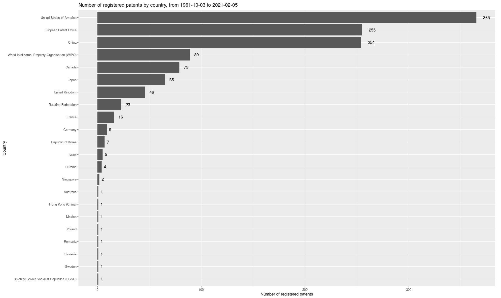
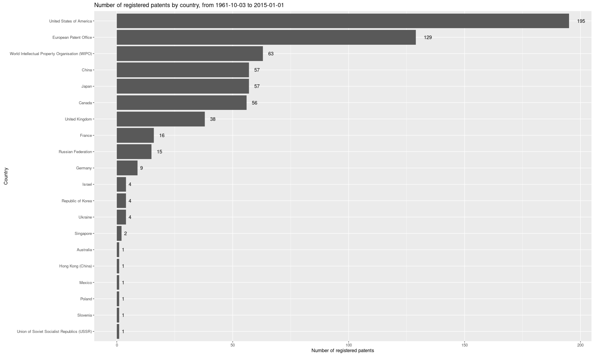
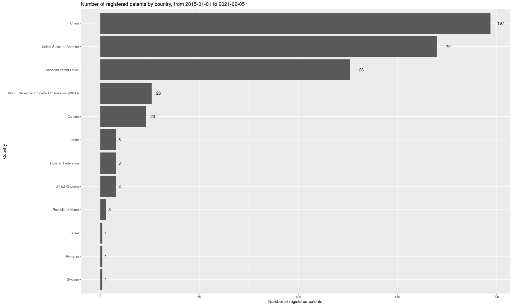
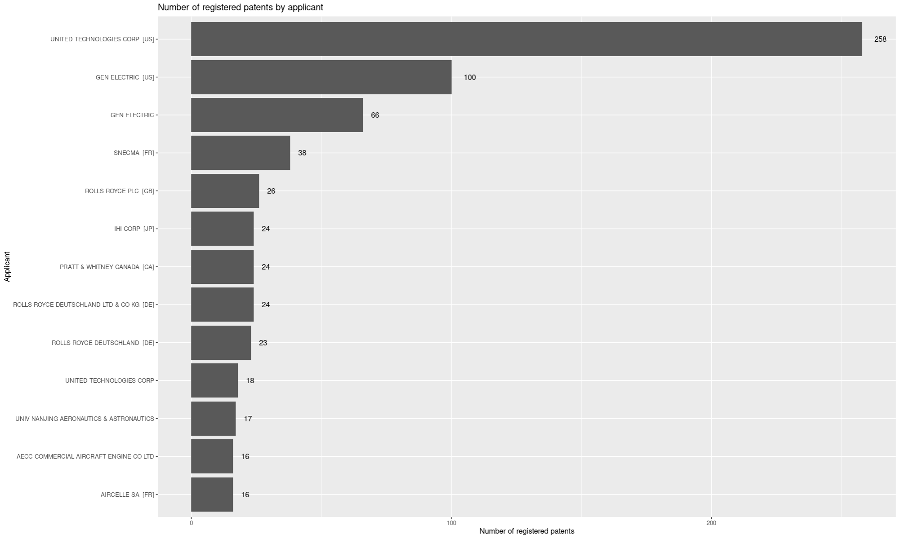
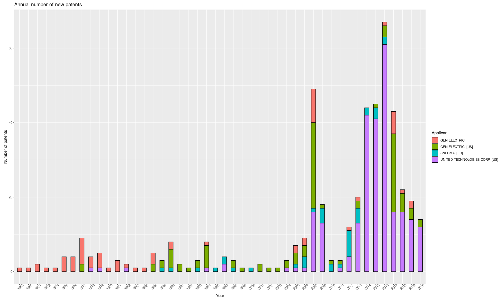
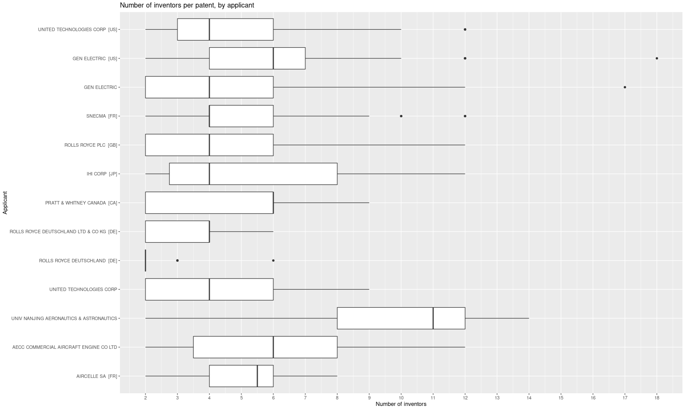
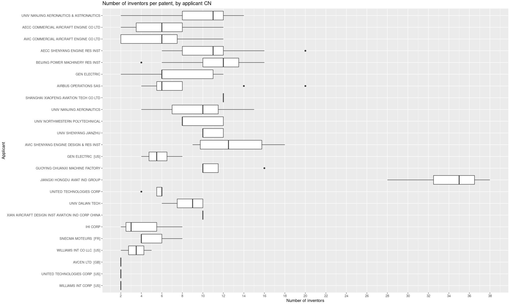

# Introduction
Modern commercial aviation is powered by turbofan engines. These engines are engineering marvels dealing with extreme temperatures, stress, vibration, balancing on the edge of compressor surge. It is no surprise that the market is dominated by 3 major players.  
The main goal of this analysis is to discover and describe changing trends in the market, based on record of patent applications regarding turbofan engines.

## Collecting data
Dataset [patents.csv](shiny_app/patents.csv) has been created based on records from European Patent Office collected via official [API - Open Patent Services](https://www.epo.org/searching-for-patents/data/web-services/ops.html). The process is automated by python scripts contained in [collecting_data](collecting_data) folder:
* [scraper.py](collecting_data/scraper.py): communicate with API (via [epo_ops](https://pypi.org/project/python-epo-ops-client/)), save received .json files to the drive;
* [data_mining.py](collecting_data/data_mining.py): extract valuable data from .json responses.

Final dataset consists of the following fields:
* applicant: legal entity applying for a patent;
* inventors_nb: number of inventors mentioned in application;
* pub_date: publication date, %Y-%m-%d;
* title: title of a patent;
* country_code: two-letter code of a patent office;
* country_name: full name of a patent office, mapped based on [country_code dictionary](https://register.epo.org/help?lng=en&topic=countrycodes).

## Analysis
All interactive visualisations are available as .R shiny application which can be found in [shiny_app](shiny_app/) directory.  
While the reader is encouraged to explore the data on his own via shiny application, this section presents the most interesting key findings together with brief descriptions, i.e.:
* [patents by patent office](###Country);
* [patents by applicant](###Applicant);
* [annual number of new patents](###Annual);
* [number of inventors per patent](###Inventors).

### Country
Looking at patent offices, from 1961 (first turbofan engine patent) to late 2020 (date of dataset acquisition) the most popular are those in USA, China, Canada and also broader scope offices like European Patent Office and World Intellectual Property Organisation.
  
The America with over 350 patents published there (100 more than any other country) seems to be the most important country for this business. However, taking a closer look at recent vs historical data one can see a new trend:
  
  
In China, over the last 5 years, there were 3 times as many publications as in the previous 50 years. The country is currently the most popular patent target, even more popular than the USA which dominated in the past.

### Applicant
The biggest 3 players in jet engines business are General Electric, Rolls-Royce and Pratt & Whitney. This general statement finds reflection in a visualisation of the most creative applicants. One can see that patent offices are not consistent with their naming convention (GEN ELECTRIC [US], GEN ELECTRIC). On the other hand, some differences are forced by changes in business organization form (like in Rolls Royce case). What is interesting is a fact that from over 250 unique applicants only a couple of them successfully published more than 20 patents related to turbofan engines.
  

### Annual
The other visualisation included in the application is a comparison of annual number of new patent publications. When comparing only the biggest players, one can see that from 1960s to 2005 almost all of new patents has been registered by GE. After 2005 the situation changes. While GE is still patenting some new inventions, currently it is Pratt & Whitney (as part of United Technologies holding) that is responsible for the majority of new publications.

### Inventors
Successfull registration of patents is heavily dependent on creative work of inventors. Author found it interesting to look closer at different companies and their generosity in giving credit to their employees working on new technologies. In general, there are 4 to 6 inventors mentioned in the patent, with some variations, probably dependent on the complexity of particular invention.
  
While among the biggest players the number of inventors is quite similar there is one interesting Chinese company that catches attention. It is the Hongdu Aviation that registered 4 patents, every with 28-36 inventors. The exact reason is unknown but company's involvement in design of military equipment and their early products being inspired by Russian aviation is an interesting topic, [link to source](https://en.wikipedia.org/wiki/Hongdu).

